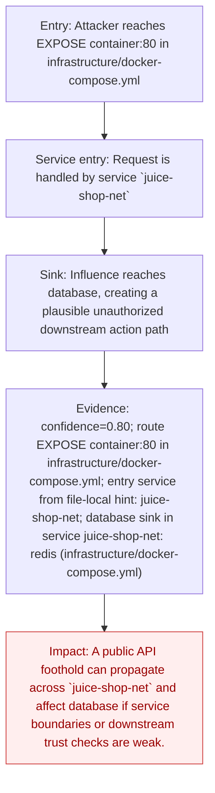

# AttackMap — Attack paths

## 1. Distributed service trust-chain abuse

```mermaid
flowchart TD
  P1_0["Entry: Attacker reaches EXPOSE container:80 in infrastructure/docker-compose.yml"]
  P1_1["Service entry: Request is handled by service `juice-shop-net`"]
  P1_2["Sink: Influence reaches database, creating a plausible unauthorized downstream action path"]
  P1_3["Evidence: confidence=0.80; route EXPOSE container:80 in infrastructure/docker-compose.yml; entry service from file-local hint: juice-shop-net; database sink in service juice-shop-net: redis (infrastructure/docker-compose.yml)"]
  P1_4["Impact: A public API foothold can propagate across `juice-shop-net` and affect database if service boundaries or downstream trust checks are weak."]
  class P1_4 impact
  P1_0 --> P1_1 --> P1_2 --> P1_3 --> P1_4
  classDef impact fill:#fee,stroke:#c33,color:#900;
```
