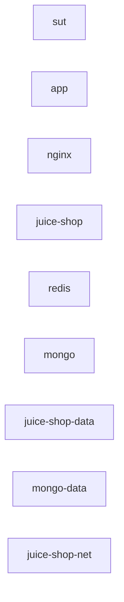

# AttackMap — Service topology

```mermaid
flowchart LR
  S0["sut"]
  S1["app"]
  S2["nginx"]
  S3["juice-shop"]
  S4["redis"]
  S5["mongo"]
  S6["juice-shop-data"]
  S7["mongo-data"]
  S8["juice-shop-net"]
```

_Edge kinds:_ **analyzer-declared** (solid), **http-call** (dashed), **env-configured** (dotted), **async-queue** (thick).
